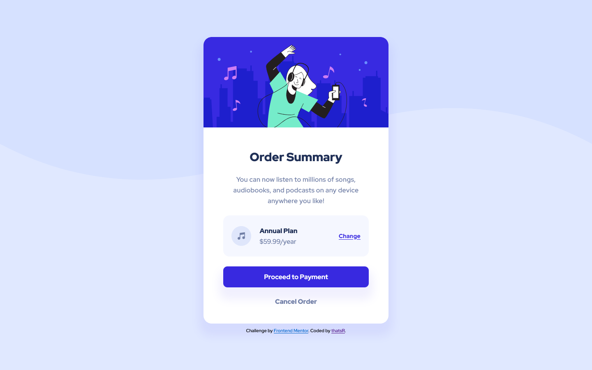

# Frontend Mentor - Order summary card solution

This is a solution to the [Order summary card challenge on Frontend Mentor](https://www.frontendmentor.io/challenges/order-summary-component-QlPmajDUj). Frontend Mentor challenges help you improve your coding skills by building realistic projects. 

## Overview

### The challenge

Users should be able to:

- See hover states for interactive elements

### Screenshot

| desktop | mobile |
| --- | --- |
|  |  |

### Links

- Solution URL: https://github.com/thatsR/FM-Order-summary-component.git
- Live Site URL: https://thatsr.github.io/FM-Order-summary-component/

## My process

### Built with

- Semantic HTML5 markup
- CSS custom properties
- Flexbox
- Sass

## Author

- Frontend Mentor - [@thatsR](https://www.frontendmentor.io/profile/thatsR)
